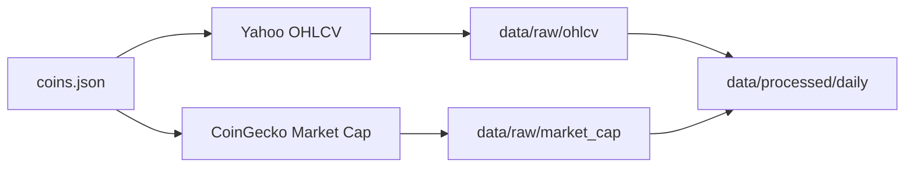
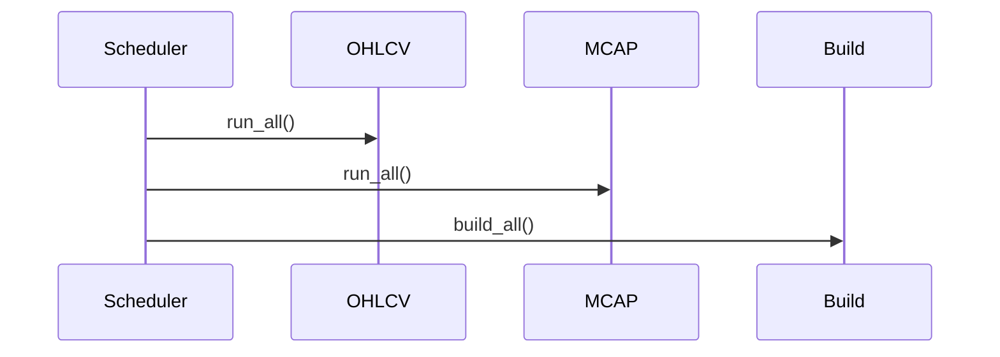

# Data Ingestion Playbook

This document explains the **operational workflow** for the APCRAS Capstone project data ingestion pipelines.

It covers:
- Adding a new coin
- Bootstrapping historical data
- Daily incremental updates
- Raw vs Processed layers
- API limitations and quota-aware design

---

## 📂 Project Data Layers

```
root/
 ├─ data/
 │   ├─ raw/
 │   │   ├─ ohlcv/
 │   │   ├─ market_cap/
 │   │   └─ metadata/
 │   └─ processed/
 │       └─ daily/
```

- **raw/** → Near-source data, reproducible
- **processed/** → Cleaned + merged datasets used by models

---

## 🖼️ Visual Overview: End-to-End Pipeline



---

## ➕ Adding a New Coin

Example asset:

- symbol: SOL
- coingecko_id: solana
- yahoo_ticker: SOL-USD

---

### Step 1: Update Metadata

File:

```
data/raw/metadata/coins.json
```

Add inside `coins`:

```json
{
  "symbol": "SOL",
  "coingecko_id": "solana",
  "yahoo_ticker": "SOL-USD",
  "start_year": 2020
}
```

---

### Step 2: Run OHLCV Ingestion

```bash
python -c "from core.pipelines.daily_ohlcv_pipeline import run_one_ticker; run_one_ticker('SOL-USD')"
```

Creates:

```
data/raw/ohlcv/SOL-USD_daily.csv
```

---

### Step 3: Run Market Cap Ingestion

```bash
python -c "import os; from core.pipelines.marketcap_pipeline import run_one_symbol; run_one_symbol('SOL','solana', api_key=os.getenv('COINGECKO_API_KEY'))"
```

Creates:

```
data/raw/market_cap/SOL_daily.csv
```

---

### Step 4: Build Processed Dataset

```bash
python -c "from core.pipelines.build_processed_daily import build_one; build_one('SOL','SOL-USD')"
```

Creates:

```
data/processed/daily/SOL_daily.csv
```

---

## 🔁 Daily Update Routine

Every scheduled run (cron / scheduler / CI job):



Commands:

```bash
python -c "from core.pipelines.daily_ohlcv_pipeline import run_all; run_all()"

python -c "import os; from core.pipelines.marketcap_pipeline import run_all; run_all(api_key=os.getenv('COINGECKO_API_KEY'))"

python -c "from core.pipelines.build_processed_daily import build_all; build_all()"
```

---

## 🧠 Incremental Logic

### OHLCV

- Read last date from CSV
- Fetch from next day
- Append
- Deduplicate on `date`
- Skip if already up-to-date

### Market Cap

- Read last date
- Request only missing days
- Respect API limits
- Merge + dedupe

---

## ⚠️ API Limitations

### Yahoo
- May return empty frames for delisted assets
- Guard logic prevents crashes

### CoinGecko
- Historical range depends on plan
- Config-driven `coingecko_default_days`
- Incremental fetch to reduce quota use

---

## 🧾 Configuration Location

File:

```
core/config/ingestion_config.py
```

Controls:
- Paths
- Intervals
- CoinGecko default lookback window

---

## ✅ Design Principles

- Raw never overwritten blindly
- Processed rebuilt from raw
- Incremental by default
- Schema stable
- Fail-safe pipelines

---

## 📌 When to Commit

Commit:
- core/
- docs/
- metadata

Ignore:
- full raw datasets
- generated processed files

---

## 🎯 Summary

Adding a new asset requires:

1. Updating metadata
2. Running raw ingestion pipelines
3. Rebuilding processed datasets

Daily operation runs all pipelines incrementally and safely.

---

End of playbook.

